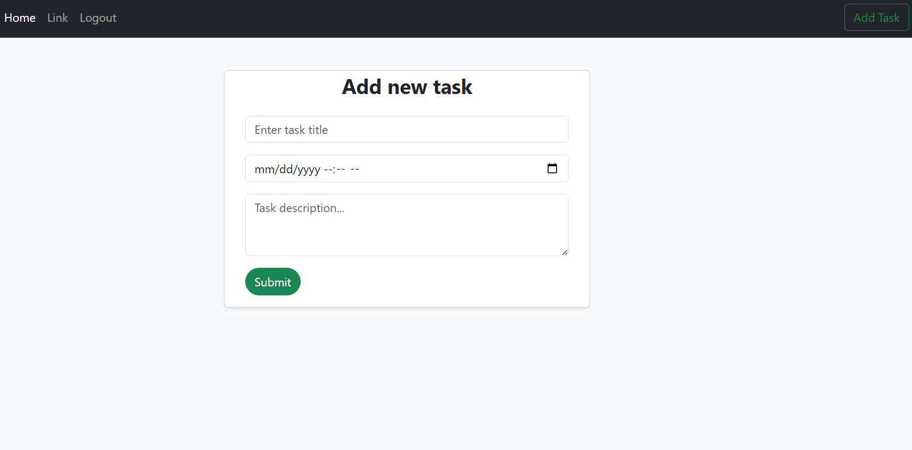
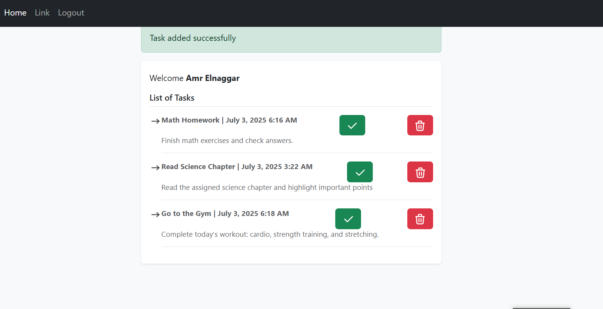

# TodoApp

This is a personal project developed as part of my Laravel learning journey.  
It demonstrates user authentication, task management, and CRUD functionality using Laravel 10 and Bootstrap 5.

## Features
- User registration and login with email and password.
- Create tasks with a title, description, and deadline.
- View a paginated list of incomplete tasks.
- Mark tasks as completed or delete them.
- Logout functionality.
- Responsive UI with Bootstrap styling.

## Requirements
- PHP >= 8.1
- Composer
- Laravel 10.x
- MySQL or another supported database
- Node.js and npm (for compiling assets, if needed)

## Installation
1. **Clone the repository**:
   ```bash
   git clone https://github.com/AmrElnaggarDev/todoapp.git
   ```
2. **Navigate to the project directory**:
   ```bash
   cd todoapp
   ```
3. **Install PHP dependencies**:
   ```bash
   composer install
   ```
4. **Copy the environment file**:
   ```bash
   cp .env.example .env
   ```
5. **Generate an application key**:
   ```bash
   php artisan key:generate
   ```
6. **Configure the database**:
   - Open `.env` and set your database credentials (e.g., `DB_DATABASE`, `DB_USERNAME`, `DB_PASSWORD`).
7. **Run migrations**:
   ```bash
   php artisan migrate
   ```
8. **(Optional) Compile front-end assets**:
   If you’ve added custom CSS/JS:
   ```bash
   npm install && npm run build
   ```
9. **Start the development server**:
   ```bash
   php artisan serve
   ```
10. Visit `http://localhost:8000` in your browser.

## Usage
- **Register**: Create a new account with your name, email, and password.
- **Log in**: Use your credentials to access the task manager.
- **Manage Tasks**:
  - Add a new task with a title, description, and deadline.
  - View your incomplete tasks on the homepage.
  - Mark tasks as completed or delete them.
- **Log out**: End your session when done.

## Screenshots

### 🔐 Add Task


### ✅ Task List Page


## Technologies Used
- **Laravel 10.x**: PHP framework for back-end logic.
- **Bootstrap 5**: For responsive front-end styling.
- **MySQL**: Database for storing users and tasks.
- **Blade**: Laravel’s templating engine for views.

## Notes
- This is a beginner-level project created to learn Laravel’s core features, including authentication, Eloquent ORM, and Blade templating.
- Ensure you do not commit the `.env` file to GitHub. Use `.env.example` for configuration templates.
